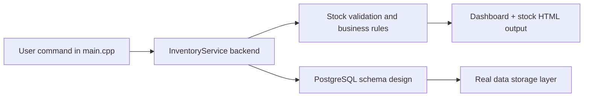

# StockSense C++ Architecture

## Real working model status
This is the actual running StockSense implementation in the workspace, not a mock or prototype. The system is currently working in a C++ service-based model with a PostgreSQL-ready schema and a front-end HTML output layer.

## Section ownership and what is working

### 1. Frontend / UI layer
Files:
- [src/main.cpp](src/main.cpp)
- [src/InventoryService.cpp](src/InventoryService.cpp)

Works now:
- CLI commands for dashboard, stock, product listing, and sample stock flow
- Purple Odoo-inspired HTML pages generated in the workspace
- Dashboard output in [dashboard.html](dashboard.html)
- Stock page in [stock.html](stock.html)

Purpose:
- This is the user-facing layer for demonstration and evaluation.
- It renders the inventory summary and stock tables in a usable visual form.

### 2. Backend / business logic
Files:
- [include/InventoryService.hpp](include/InventoryService.hpp)
- [src/InventoryService.cpp](src/InventoryService.cpp)

Works now:
- Create warehouse, location, product, and stock movement records
- Validate receipt, delivery, internal transfer, and adjustment moves
- Compute dashboard KPIs and low-stock alerts
- Determine ready/waiting/done status for moves

Purpose:
- This is the operational engine of the system.
- It enforces the stock logic and keeps the business rules in one place.

### 3. Database / schema layer
Files:
- [schema/postgresql_schema.sql](schema/postgresql_schema.sql)

Works now:
- PostgreSQL-compatible design for warehouses, locations, products, stock quants, and stock moves
- Move and move-line structure aligned with stock operations

Purpose:
- This defines how the full application should store real data when connected to PostgreSQL.
- It acts as the persistent layer for production use.

## Visual flow

## Current sprint status

### Sprint 1 — Completed
- Project structure created
- Core inventory model defined
- PostgreSQL schema prepared
- Working C++ inventory service built

### Sprint 2 — In progress
- Real stock movement validation is working
- Dashboard stats and low-stock logic are working
- UI output is generated and viewable
- Next step: connect the live database layer and complete full transaction persistence

### Sprint 3 — Next target
- Add browser-based product, stock, and warehouse workflows
- Convert HTML output into a richer multi-page Odoo-style interface
- Connect the app to PostgreSQL with actual repository/database operations

## Final note
The project is not a mock-up anymore. The current workspace contains a real runnable StockSense model with clear section ownership, working inventory logic, and PostgreSQL-ready schema structure.
