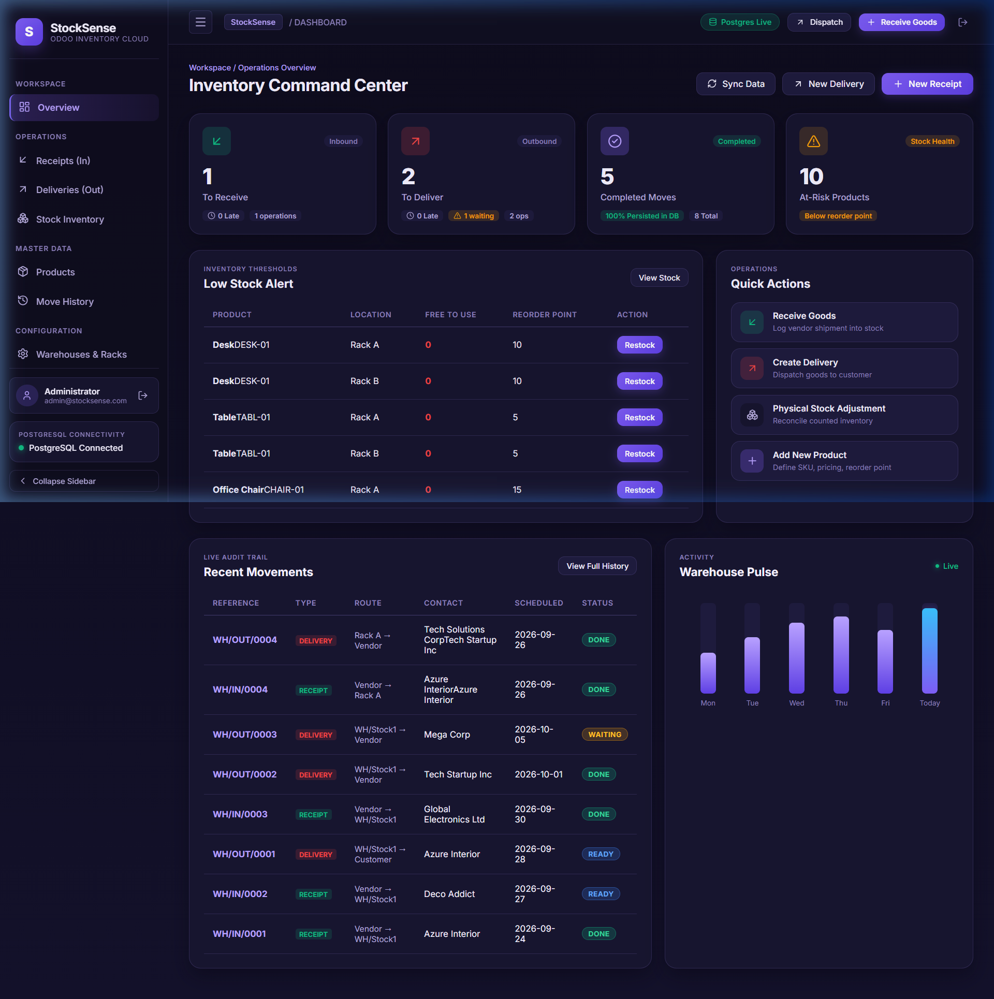

# StockSense — Enterprise Inventory Management System

> **Odoo × LPU Hackathon Submission**
> Built to solve real warehouse chaos with a production-grade inventory engine.



---

## 📌 Problem Statement (from Hackathon PDF)

Modern businesses struggle with:
- **No real-time visibility** into stock levels across multiple warehouses
- **Manual, error-prone** inbound and outbound tracking
- **Zero audit trail** — no history of who moved what, when, and where
- **Stockouts and overstocking** due to missing reorder alerts
- **Disconnected tools** — spreadsheets, WhatsApp messages, and guesswork

**StockSense solves this** by providing a single enterprise-grade system that tracks every stock movement — from vendor receipt to customer delivery — with full PostgreSQL persistence and zero mock data.

---

## ✅ Features Delivered (Hackathon Requirements)

| Requirement | Status | Details |
|---|---|---|
| Product & SKU Management | ✅ | Create, view, and manage products with categories, units, cost, and reorder points |
| Warehouse & Location Setup | ✅ | Multi-warehouse support with physical racks and virtual Vendor/Customer locations |
| Inbound Receipts (Goods In) | ✅ | Create receipts from vendors, validate to update stock, auto-reference WH/IN/XXXX |
| Outbound Deliveries (Goods Out) | ✅ | Create deliveries to customers, stock availability checked before validation |
| Stock Inventory View | ✅ | Real-time on-hand, reserved, and free-to-use quantities per product per location |
| Move History & Audit Trail | ✅ | Immutable log of all stock movements with type, route, contact, date, and status |
| Dashboard KPIs | ✅ | Live counts for receipts, deliveries, low-stock alerts, and warehouse pulse chart |
| Stock Adjustment | ✅ | Manual quantity correction with delta logging |
| Low Stock Alerts | ✅ | Products flagged when on_hand - reserved ≤ reorder_point |
| Status Engine | ✅ | WAITING → READY → DONE lifecycle with stock availability check |
| Authentication | ✅ | Signup, Login, OTP email verification, JWT sessions |
| Real PostgreSQL Persistence | ✅ | All data is stored in a real PostgreSQL database — zero mock data |
| Double-Entry Stock Logic | ✅ | Every move has source + destination location (same as Odoo movement model) |

---

## 🏗️ Architecture

```
┌─────────────────────────────────────────────────────────────────┐
│                        BROWSER (Client)                         │
│                                                                 │
│  ┌──────────────┐  ┌──────────────┐  ┌──────────────────────┐  │
│  │ Landing Page │  │  Auth Pages  │  │   Dashboard / App    │  │
│  │  (Public)    │  │  Login/OTP   │  │  (Protected Route)   │  │
│  └──────┬───────┘  └──────┬───────┘  └──────────┬───────────┘  │
│         └─────────────────┴──────────────────────┘             │
│                React 18 + TypeScript | Vite (Port 5173)        │
│                Framer Motion animations | Lucide React icons    │
└──────────────────────────┬──────────────────────────────────────┘
                           │  HTTP /api/* (proxied by Vite)
                           ▼
┌─────────────────────────────────────────────────────────────────┐
│                    EXPRESS API SERVER                           │
│                    Node.js + TypeScript | Port 3001             │
│                                                                 │
│  Auth Routes          │  Inventory Routes  │  Business Logic    │
│  POST /api/signup     │  GET /api/products │  InventoryService  │
│  POST /api/login      │  GET /api/receipts │  Stock validation  │
│  POST /api/verify-otp │  POST /api/deliver │  Reference numbers │
│  JWT + bcryptjs       │  PATCH /validate   │  Status: W→R→DONE  │
└──────────────────────────┬──────────────────────────────────────┘
                           │  node-postgres (pg)
                           ▼
┌─────────────────────────────────────────────────────────────────┐
│                     PostgreSQL DATABASE                         │
│                     Port 5432  |  Database: stocksense          │
│                                                                 │
│  users            → authentication + OTP                       │
│  warehouses       → warehouse master data                       │
│  locations        → physical + virtual locations per warehouse  │
│  products         → SKU, category, cost, reorder point          │
│  stock_quants     → on_hand_qty + reserved_qty (LIVE STOCK)     │
│  stock_moves      → all receipts, deliveries, adjustments       │
│  stock_move_lines → line items per move (multi-product support) │
│  move_sequences   → auto-increment WH/IN/0001 references        │
└─────────────────────────────────────────────────────────────────┘
```

### Tech Stack

| Layer | Technology |
|---|---|
| Frontend | React 18 + TypeScript |
| Build Tool | Vite 5 |
| Animations | Framer Motion |
| Icons | Lucide React |
| Backend | Express.js + TypeScript (tsx) |
| Database | PostgreSQL 14+ |
| Auth | bcryptjs + jsonwebtoken (JWT) |
| DB Client | node-postgres (pg) |

---

## 🗂️ Project Structure

```
Odoo-StockSense/
├── src/
│   ├── main.tsx                  # App root, routing, auth state
│   ├── styles.css                # Global design system + all component styles
│   ├── api.ts                    # API client (all fetch calls)
│   ├── types.ts                  # Shared TypeScript interfaces
│   ├── pages/
│   │   ├── LandingPage.tsx       # Public landing page
│   │   ├── AuthPage.tsx          # Login / Signup / OTP verification
│   │   ├── DashboardPage.tsx     # KPI cards + recent moves + warehouse pulse
│   │   ├── ProductsPage.tsx      # Product catalog management
│   │   ├── ReceiptsPage.tsx      # Inbound goods (Goods In)
│   │   ├── DeliveriesPage.tsx    # Outbound goods (Goods Out)
│   │   ├── StockPage.tsx         # Stock inventory + manual adjustment
│   │   ├── MoveHistoryPage.tsx   # Full audit trail
│   │   └── WarehousesPage.tsx    # Warehouse & rack configuration
│   └── components/
│       ├── Sidebar.tsx           # Collapsible nav sidebar with mobile drawer
│       └── Toast.tsx             # Notification toasts
├── server/
│   ├── server.ts                 # Express API (all routes)
│   ├── db.ts                     # PostgreSQL connection pool
│   ├── initDb.ts                 # DB initializer + seed data
│   └── services/
│       └── inventoryService.ts   # Stock move business logic
├── schema.sql                    # Full PostgreSQL schema
├── docker-compose.yml            # Docker setup (optional)
├── .env                          # Environment config (not committed)
├── .env.example                  # Template for environment config
└── vite.config.ts                # Vite + API proxy config
```

---

## 🚀 Quick Start

### Prerequisites
- Node.js 18+
- PostgreSQL 14+ (running locally)
- Git

### 1. Clone the repo
```bash
git clone https://github.com/lakotiasaikiran/Odoo-StockSense.git
cd Odoo-StockSense
```

### 2. Install dependencies
```bash
npm install
```

### 3. Configure environment
```bash
cp .env.example .env
```
Edit `.env`:
```env
PORT=3001
POSTGRES_HOST=localhost
POSTGRES_PORT=5432
POSTGRES_DB=stocksense
POSTGRES_USER=postgres
POSTGRES_PASSWORD=your_password_here
```

### 4. Create the database & run schema
```bash
# Open psql and create the database
psql -U postgres -c "CREATE DATABASE stocksense;"

# Apply the schema
psql -U postgres -d stocksense -f schema.sql
```

### 5. Start the API server
```bash
npx tsx server/server.ts
```
*(The server auto-initializes tables + seed data on first run)*

### 6. Start the frontend (new terminal)
```bash
npm run dev
```

### 7. Open the app
```
http://localhost:5173
```

**Demo Admin Login:**
- Email: `admin@stocksense.com`
- Password: `admin123`

---

## 📊 Database Schema

```
users               → id, name, email, password_hash, role, otp_code, otp_expires_at
warehouses          → id, name, short_code, address
locations           → id, warehouse_id, name, short_code, is_virtual
product_categories  → id, name
products            → id, sku, name, category_id, unit_of_measure, cost_per_unit, reorder_point
stock_quants        → id, product_id, location_id, on_hand_qty, reserved_qty  ← LIVE STOCK
stock_moves         → id, reference, move_type, source_location_id, dest_location_id, status
stock_move_lines    → id, move_id, product_id, quantity
move_sequences      → warehouse_id, move_type, last_number  ← auto WH/IN/0001
```

Key formula: `free_to_use = on_hand_qty - reserved_qty`

---

## 🎬 Demo Video Flow — End to End

**1. Landing Page (`/`)**
→ Show hero headline, feature cards, architecture section

**2. Sign Up (`/signup`)**
→ Enter name, email, password → OTP verification → redirected to dashboard

**3. Dashboard (`/app`)**
→ KPI cards (Receipts, Deliveries, Low Stock, Products)
→ Recent Movements table with RECEIPT/DELIVERY type badges
→ Warehouse Pulse bar chart

**4. Create a Receipt**
→ Click `+ Receive Goods` → fill vendor + product + qty → Validate
→ Go to Stock Inventory → confirm on_hand_qty increased ✅

**5. Create a Delivery**
→ Click `+ Dispatch` → fill customer + product + qty
→ System shows WAITING if stock low, READY if available
→ Validate → stock decreases ✅

**6. Stock Inventory**
→ Show on-hand / reserved / free-to-use per product
→ Show `Adjust Qty` for a manual count correction

**7. Move History**
→ Full audit trail — every operation, immutable, with timestamps

**8. Products & Warehouses**
→ Products with SKUs, categories, reorder points
→ Warehouse locations including virtual Vendor/Customer nodes

---

## 🗄️ Viewing PostgreSQL Data (for Demo Video)

### Option A — pgAdmin (best for video demo)
1. Open **pgAdmin 4** (Windows Start Menu)
2. Connect to `localhost:5432` with your postgres password
3. Navigate: `Servers → PostgreSQL → Databases → stocksense → Schemas → public → Tables`
4. Right-click any table → **View/Edit Data → All Rows**

Key tables to show:
- `stock_quants` → live stock levels
- `stock_moves` → all receipts and deliveries
- `users` → registered accounts

### Option B — psql Terminal
```bash
psql -U postgres -d stocksense
```

```sql
-- Live stock levels
SELECT p.name, p.sku, sq.on_hand_qty, sq.reserved_qty,
       (sq.on_hand_qty - sq.reserved_qty) AS free_to_use
FROM stock_quants sq JOIN products p ON p.id = sq.product_id;

-- All stock moves
SELECT reference, move_type, contact, status, scheduled_date
FROM stock_moves ORDER BY created_at DESC;

-- All users
SELECT id, name, email, role, created_at FROM users;

-- All tables
\dt
```

### Option C — VS Code SQLTools Extension
1. Install `SQLTools` + `SQLTools PostgreSQL` driver in VS Code
2. New connection: host=localhost, port=5432, db=stocksense, user=postgres
3. Run queries right inside VS Code while the app is visible

---

## 🔐 Auth Flow

```
Signup → bcrypt hash stored in PostgreSQL users table
       → OTP generated (6-digit) stored in users.otp_code
       → User enters OTP → verified → JWT token returned
       → Token stored in localStorage (stocksense_token)
       → All /api/* calls send Authorization: Bearer <token>
```

---

## 💡 Key Design Decisions

1. **Single `stock_moves` table** for all operation types — same as real Odoo's model
2. **Double-entry locations** — every move has source + destination (Vendor→RackA or RackA→Customer)
3. **`stock_quants`** is the live ledger — updated atomically on validation
4. **Status engine** — WAITING (no stock) → READY (stock available) → DONE (validated)
5. **Reference auto-numbering** — WH/IN/0001, WH/OUT/0001 per warehouse per type

---

## 👤 Author

**Saikiran Lakotia**
Odoo × LPU Hackathon 2026
GitHub: [@lakotiasaikiran](https://github.com/lakotiasaikiran)
